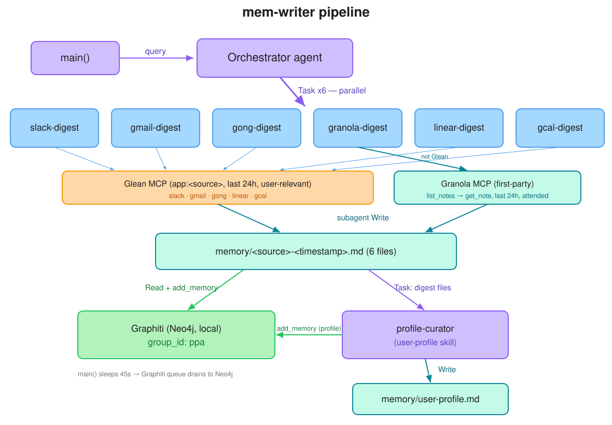
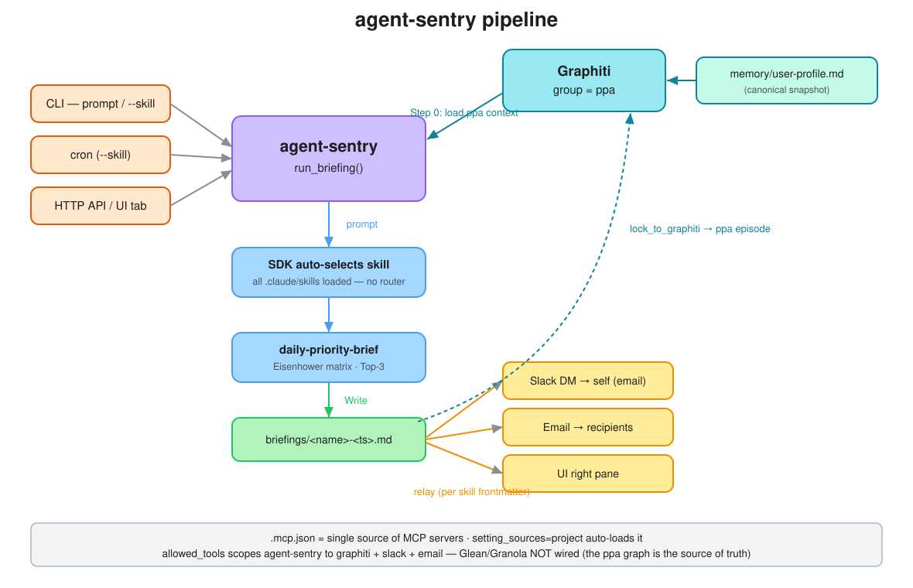
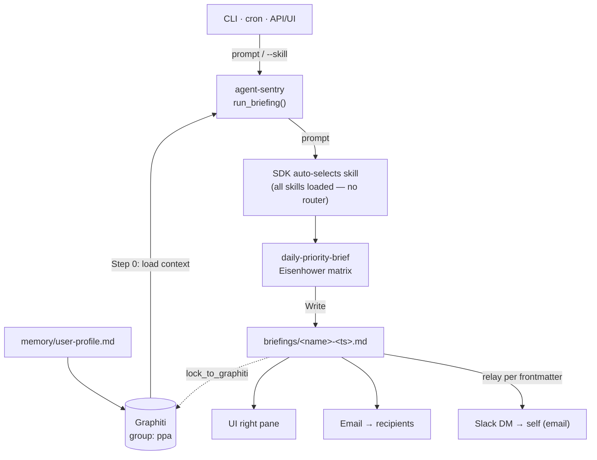

# ppa — personal digest writer

`src/mem-writer.py` is a multi-agent **personal daily digest writer** built on the
[Claude Agent SDK](https://github.com/anthropics/claude-agent-sdk-python). A main
**orchestrator** agent fans out to six per-source sub-agents — one per source system —
to harvest the user's recent, relevant artifacts, writes each to a markdown file, then
ingests everything into a local **Graphiti** knowledge graph and distils a durable
**user profile**.

Five of the six sources are reached **through the Glean MCP server**. **Granola is the
exception** — Glean doesn't index Granola for this user, so it's reached through a
**first-party Granola MCP server** (`src/granola_mcp_server.py`, a thin wrapper over
Granola's public API) instead.

## Pipeline



> Editable diagram: [open in Excalidraw](https://excalidraw.com/#json=EIdr7KpmElv0Tmw92-qq5,75dJe3A7OWW6WF4F8gVGiQ)
> · source: [`docs/mem-writer-pipeline.excalidraw.json`](docs/mem-writer-pipeline.excalidraw.json)

<details>
<summary>Text fallback (mermaid)</summary>

```mermaid
flowchart TD
  main["main()"] -->|query| orch["Orchestrator agent"]
  orch -->|"Task x6 — parallel"| subs["slack · gmail · gong · linear · gcal<br>(*-digest subagents)"]
  orch -->|"Task — parallel"| gsub["granola-digest"]
  subs -->|"app:&lt;source&gt;, last 24h, user-relevant"| glean["Glean MCP"]
  gsub -->|"list_notes/get_note, last 24h, attended"| gran["Granola MCP<br>(first-party)"]
  glean -->|"subagent Write"| mem["memory/&lt;source&gt;-&lt;timestamp&gt;.md  (6 files)"]
  gran -->|"subagent Write"| mem
  mem -->|"Read + add_memory"| graph["Graphiti (Neo4j, local)<br>group_id: ppa"]
  mem -->|"Task: digest files"| pc["profile-curator<br>(user-profile skill)"]
  pc -->|"add_memory (profile)"| graph
  pc -->|Write| up["memory/user-profile.md"]
```
</details>

## How it works

1. **Orchestrator** (`ClaudeAgentOptions` in `src/mem-writer.py`) does no gathering itself.
   It delegates **one `Task` per source, in parallel**, to six `AgentDefinition`
   sub-agents: `slack-digest`, `gmail-digest`, `gong-digest`, `granola-digest`,
   `linear-digest`, `gcal-digest`.
2. **Each source sub-agent** uses the shared **`source-digest`** skill. It scopes its
   queries to its one source, applies that source's user-relevance rule, and writes
   `memory/<source>-<timestamp>.md`. Each has only its source's tools + `Write` — no
   Graphiti access. The five Glean sub-agents scope every Glean query with `app:<Source>`;
   the **granola** sub-agent instead calls the Granola MCP (`mcp__granola__list_notes` →
   `mcp__granola__get_note`).

   | source | reached via | relevant when… |
   |---|---|---|
   | slack | `app:Slack` (Glean) | user tagged directly/indirectly or participated in the thread |
   | gmail | `app:Gmail` (Glean) | user is in **to / cc / bcc** |
   | gong | `app:Gong` (Glean) | user was **invited to** the call |
   | granola | **Granola MCP** (`list_notes`/`get_note`) | user **attended / was invited to** the meeting |
   | linear | `app:Linear` (Glean) | issue assigned to / created by / mentioning / subscribed-to user |
   | google calendar | `app:"Google Calendar"` (Glean) | user is an **attendee / invitee** |

3. **Graphiti ingest** — once the six files exist, the orchestrator reads each and calls
   `mcp__graphiti__add_memory` once per file under **`group_id="ppa"`**
   (`name="<source> digest <ts>"`).
4. **profile-curator** sub-agent — the orchestrator then delegates the six digest files to
   it. Using the reusable **`user-profile`** skill, it extracts durable, slow-changing
   facts (role, recurring collaborators, projects, recurring meetings, topics,
   preferences), **dedups against what is already stored**, and persists to **both**
   Graphiti (`group_id="ppa"`, episode `profile: <user>`) **and** `memory/user-profile.md`.
5. **Drain** — Graphiti's `add_memory` only *queues* an episode (a background worker
   extracts entities and writes to Neo4j). `main()` holds the client open for
   `GRAPHITI_DRAIN_SECONDS` (45s) so queued episodes land before the stdio MCP server is
   torn down.

### Why one Graphiti group (`ppa`) for everything

Digests and profile facts share a single `group_id`. Graphiti scopes entity resolution and
edges **within** a group, so a shared group lets profile entities (e.g. a recurring
collaborator) link to the same people appearing in the daily digest episodes — one
connected personal graph, not isolated partitions. Episode kinds stay distinguishable by
episode name (`profile: <user>` vs `<source> digest <ts>`). `memory/user-profile.md` is the
clean standalone read of the profile.

## Skills

| skill | used by | purpose |
|---|---|---|
| [`source-digest`](.claude/skills/source-digest/SKILL.md) | the 6 source sub-agents (+ orchestrator) | harvest ONE source via Glean, scoped + user-relevant, write the digest file |
| [`user-profile`](.claude/skills/user-profile/SKILL.md) | `profile-curator` (+ any other agent) | generic: from any input → extract durable facts → dedup → write to Graphiti + `user-profile.md` |

The `user-profile` skill is deliberately **generic / reusable** — it curates the profile
from whatever input the caller names (digest files, a chat response, an email thread), so
other agents that process user responses can reuse it, not just mem-writer.

## MCP servers

| server | transport | tools (prefix) |
|---|---|---|
| `graphiti` | stdio launcher (`~/.config/claude-mcp/graphiti-launcher.sh`), local Neo4j | `mcp__graphiti__*` |
| `granola` | stdio launcher (`~/.config/claude-mcp/granola-launcher.sh`) → `src/granola_mcp_server.py` (FastMCP over Granola's public API) | `mcp__granola__*` |
| `glean` | HTTP, `${GLEAN_MCP_URL}/mcp/default` + bearer token | `mcp__glean__*` |

Server definitions live in **one place** — [`.mcp.json`](.mcp.json). The SDK agent loads it
automatically (passing `skills=[...]` enables the `project` setting source; `strict_mcp_config`
is left False), and headless `claude -p` reads it too — so no server dict is hard-coded in
`src/mem-writer.py`. `mem-writer` still fail-fasts if the Glean env vars are missing. The
`granola` launcher loads the repo `.env` (for `GRANOLA_API_KEY`) and runs the first-party
server on the repo `.venv`.

## Setup

```bash
cp .env.example .env   # then fill in the values
uv sync                # or: pip install -e .
```

Required in `.env`:

| var | purpose |
|---|---|
| `ANTHROPIC_API_KEY` | claude-agent-sdk (the LiteLLM gateway can't be used with the SDK) |
| `GLEAN_MCP_URL`, `GLEAN_MCP_AUTH_TOKEN` | Glean MCP — five of the six sources reached via Glean |
| `GRANOLA_API_KEY` | Granola public API key (`grn_...`) for the first-party Granola MCP (granola source). Granola desktop → Settings → Connectors → API keys |
| `DIGEST_USER_EMAIL` *(optional)* | sharpens Glean `to:`/`from:`/`cc:` filters; defaults to the Glean-authenticated user |
| `DIGEST_TIMEFRAME_HOURS` *(optional)* | lookback window, default `24` |

Graphiti must be running locally (the launcher self-loads its own `.env` and starts the
MCP server against local Neo4j).

## Run

**Full pipeline (SDK agent):**
```bash
.venv/bin/python src/mem-writer.py
```
Produces `memory/<source>-<timestamp>.md` ×6 + `memory/user-profile.md`, and lands the
matching episodes in Graphiti under `group_id="ppa"`.

**Headless, single skill (`claude -p`):** a skill reproduces *its own* step — not the
fan-out. `.mcp.json` gives the headless session the same Glean/Graphiti tools:
```bash
claude -p "Use the source-digest skill for source=slack, timeframe=last 24h." \
  --allowedTools "mcp__glean__search,mcp__glean__read_document,mcp__glean__chat,mcp__glean__meeting_lookup,Write"
```
For `source=granola`, swap in the Granola tools instead:
```bash
claude -p "Use the source-digest skill for source=granola, timeframe=last 24h." \
  --allowedTools "mcp__granola__list_notes,mcp__granola__get_note,Write"
```
Caveats vs the SDK agent: (1) **no fan-out/sequencing** — one `-p` call = one source (or
one profile curation); script the six calls + the profile step yourself. (2) **Graphiti
drain** — `claude -p` exits on completion and tears down the stdio graphiti server
immediately, so a just-queued episode can be lost; re-query/verify and re-run if it didn't
land (the SDK agent's 45s drain handles this automatically).

## Layout

```
src/mem-writer.py                       orchestrator + 7 sub-agents
src/granola_mcp_server.py               first-party Granola MCP (FastMCP over public API)
.claude/skills/source-digest/SKILL.md   per-source harvest skill (shared)
.claude/skills/user-profile/SKILL.md    durable-profile curation skill (reusable)
.mcp.json                               glean + graphiti + granola wiring for headless claude -p
memory/                                 digest outputs + user-profile.md (runtime)
docs/mem-writer-pipeline.svg            pipeline diagram (embedded above)
docs/mem-writer-pipeline.excalidraw.json  editable diagram source
```

---

# agent-sentry — generic briefing agent

`src/agent-sentry.py` is the **generic** sibling of mem-writer. Where mem-writer *produces*
the `ppa` Graphiti graph, agent-sentry *consumes* it. It:

1. **loads context** from Graphiti group `ppa` (the user profile + relevant facts/episodes
   mem-writer wrote) as the input for the run,
2. **auto-selects a skill** — every skill in `.claude/skills/` is loaded into the agent and
   the Claude Agent SDK picks the one matching the prompt (no routing code),
3. runs the skill and writes a **briefing** to `briefings/<briefing-name>-<UTC-ts>.md`,
4. **relays** the briefing wherever the *skill's frontmatter* says (Slack / email / UI),
5. optionally **locks** the briefing back into Graphiti.

It runs three ways — interactive CLI, unattended cron, and an HTTP API for a (later-phase)
tabbed UI. Shared engine: [`src/sentry_core.py`](src/sentry_core.py) (`run_briefing`).

## Pipeline



> Editable source: [`docs/agent-sentry-pipeline.excalidraw.json`](docs/agent-sentry-pipeline.excalidraw.json)
> (open at [excalidraw.com](https://excalidraw.com) → Menu → Open).

<details>
<summary>Text fallback (mermaid)</summary>


</details>

MCP servers are defined once in [`.mcp.json`](.mcp.json) (the SDK auto-loads it via the
`project` setting source); `allowed_tools` scopes agent-sentry to **graphiti + slack + email**.
Glean/Granola are deliberately **not** wired in — mem-writer already harvested them into the
`ppa` graph, which agent-sentry treats as the source of truth.

## Skill frontmatter (the unit of configuration)

Drop a `SKILL.md` in `.claude/skills/`; agent-sentry runs it with no code change. Beyond the
SDK's `name`/`description`, add a `briefing:` block — agent-sentry parses it directly:

```yaml
---
name: daily-priority-brief
description: <when to trigger this skill ...>   # also the UI tab label + auto-select signal
briefing:
  name: daily-priority-brief         # output filename stem (defaults to the skill name)
  relay: [slack, email, ui]          # zero or more of: slack | email | ui
  slack_channel: "self"              # required if 'slack' in relay — see below
  email_to: ["leadership@atlan.com"] # required if 'email' in relay; "self" also allowed
  lock_to_graphiti: true             # persist the briefing into Graphiti (default false)
  graphiti_group: ppa                # optional, default "ppa"
---
```

A declared relay with no target (`slack` without `slack_channel`, `email` without `email_to`)
fails fast at startup. Relay destinations come **only** from frontmatter — never the prompt —
so a request can't redirect a briefing elsewhere.

**`self` sentinel** — a `slack_channel` / `email_to` of `self` (or `@me`) resolves at runtime
to the configured user (`SENTRY_USER_EMAIL`, falling back to `DIGEST_USER_EMAIL` from `.env`),
so skills stay identity-agnostic. For Slack, the [first-party Slack MCP](src/slack_mcp_server.py)
turns that email into a **direct message** to the user (`users.lookupByEmail` → `conversations.open`).
The shipped [`daily-priority-brief`](.claude/skills/daily-priority-brief/SKILL.md) skill uses
`relay: [ui, slack]` with `slack_channel: self` — it DMs the user a daily Eisenhower-matrix brief.

## CLI / cron

```bash
# Interactive — skill auto-selected from the prompt:
.venv/bin/python src/agent-sentry.py --prompt "what should I focus on today?"

# Deterministic (preferred for cron) — name the skill, machine output:
.venv/bin/python src/agent-sentry.py --skill daily-priority-brief --json

# Testing — write the briefing but skip relay + Graphiti:
.venv/bin/python src/agent-sentry.py --skill daily-priority-brief --dry-run
```

Cron: see [`crontab.example`](crontab.example) (`crontab crontab.example`). Runs are
non-interactive; exit code is non-zero on failure so cron can alert.

## HTTP API (for the UI)

```bash
.venv/bin/python src/sentry_api.py        # binds 127.0.0.1:8787
# or: uvicorn src.sentry_api:app --host 127.0.0.1 --port 8787
```

| endpoint | purpose |
|---|---|
| `GET /skills` | one entry per skill → the UI builds **one tab per skill** |
| `POST /run` | body `{skill, prompt?, timeframe_hours?}` → `{skill, briefing_path, content, relayed[], graphiti_locked}`; `content` is the markdown the **right pane** renders |

Auth: every request needs `X-API-Key: $SENTRY_API_KEY`. Unknown skill → 404; over the
per-key rate limit → 429. Bound to localhost; a public deployment needs a security review
(`#bu-security-and-it`) first.

## Relay MCP servers

| server | transport | tools | env |
|---|---|---|---|
| `slack` | stdio launcher → [`src/slack_mcp_server.py`](src/slack_mcp_server.py) (FastMCP over Slack `chat.postMessage`) | `mcp__slack__send_message` | `SLACK_BOT_TOKEN` (scope `chat:write`) |
| `email` | stdio launcher → [`src/email_mcp_server.py`](src/email_mcp_server.py) (FastMCP over SMTP + STARTTLS) | `mcp__email__send` | `SMTP_HOST/PORT/USER/PASS/FROM` |

Both are first-party (no third-party MCP packages) and defined in [`.mcp.json`](.mcp.json)
alongside graphiti/granola/glean — the single source of server definitions for both agents.
agent-sentry does **not** hard-code servers; it is scoped purely by `allowed_tools` to
graphiti + slack + email. Glean/Granola are defined in the project but intentionally **not**
wired into agent-sentry — the `ppa` graph (which mem-writer populates from them) is the
source of truth. A relay server whose env (token / SMTP creds) is absent simply fails to
start and its tool is unavailable at call time.
