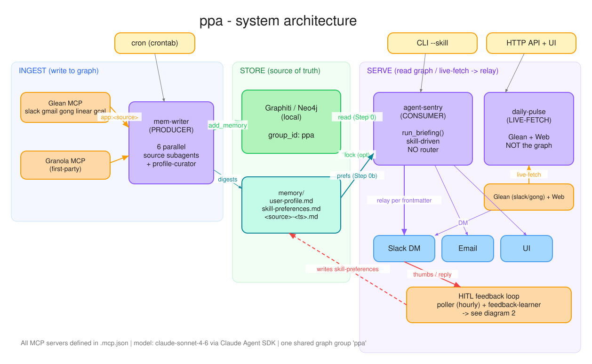
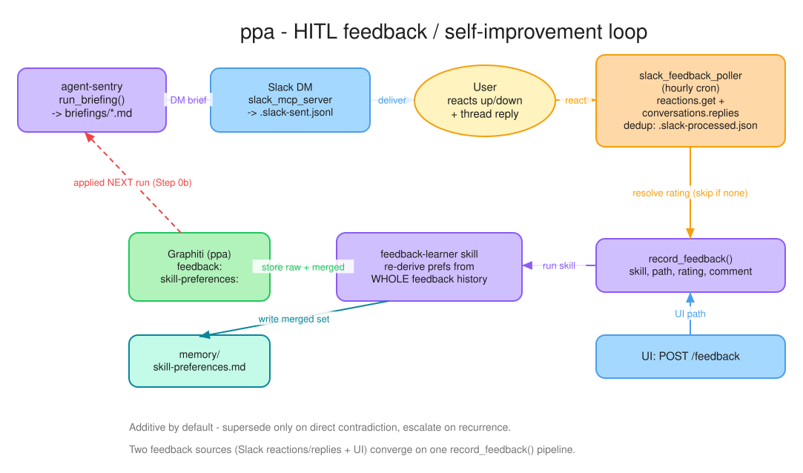

# ppa — Architecture

`ppa` is a personal AI assistant for an Atlan CSA, built on the **Claude Agent SDK**
(`claude_agent_sdk`, Python). It harvests the user's work signals (Slack, Gmail, Gong,
Linear, Calendar, Granola) into a local knowledge graph, then drives a set of **skills**
that read that graph and relay daily briefings to Slack / email / a local UI — and learns
from the user's feedback on every brief.

The system is three independent **agent harnesses** plus a shared engine, a set of
declarative **skills**, first-party **MCP servers**, one **knowledge graph** (Graphiti /
Neo4j), an **HTTP API + static UI**, and a two-way **human-in-the-loop (HITL)** feedback
loop over Slack.

> Model: `claude-sonnet-4-6` via `ANTHROPIC_API_KEY` (the SDK talks to Anthropic directly;
> the LiteLLM gateway is not compatible). Every MCP server is declared once in `.mcp.json`.

---

## 1. System overview

Three harnesses sit around one shared graph. Read the diagram left-to-right as three
planes: **INGEST** writes to the graph, **STORE** is the source of truth, **SERVE** reads
it (or live-fetches) and relays out.



> Editable source: [`architecture-overview.excalidraw.json`](architecture-overview.excalidraw.json)
> · [open in Excalidraw](https://excalidraw.com/#json=lR2BXKhX1-krs_FtQkCYz,pnmSWh_9aWomoLoQrZBq0w)

| Plane | Harness | Role | Touches the graph? |
|-------|---------|------|--------------------|
| **INGEST** | `mem-writer` | Producer — fan-out harvest → graph | writes |
| **STORE** | Graphiti (`group_id: ppa`) + `memory/` | Single source of truth | — |
| **SERVE** | `agent-sentry` | Consumer — skill-driven briefings | reads (+ optional write-back) |
| **SERVE** | `daily-pulse` | Live-fetch pulse (no graph) | no |

The central design choice is that **there is no router**. Every skill in `.claude/skills/`
is loaded and the Claude Agent SDK auto-selects the matching one from the prompt. Dropping a
new `SKILL.md` into the directory adds a capability (and a UI tab) with zero code change.

---

## 2. Repository layout

```
ppa/
├── .mcp.json                       # SINGLE source of MCP server defs (graphiti/granola/slack/email/glean)
├── .env / .env.example             # secrets + config
├── crontab.example                 # schedule for every harness
├── start-ui.sh / stop-ui.sh        # bring the API + static UI up / down
├── src/
│   ├── mem-writer.py               # HARNESS 1 — producer (parallel fan-out → Graphiti)
│   ├── agent-sentry.py             # HARNESS 2 entrypoint — thin CLI/cron wrapper
│   ├── sentry_core.py              #   shared engine: run_briefing(), record_feedback()
│   ├── sentry_api.py               #   HARNESS 2 HTTP API (FastAPI) for the UI
│   ├── daily-pulse.py              # HARNESS 3 — standalone live-fetch pulse
│   ├── granola_mcp_server.py       # first-party MCP (Granola public API)
│   ├── slack_mcp_server.py         # first-party MCP (Slack chat.postMessage)
│   ├── email_mcp_server.py         # first-party MCP (SMTP / STARTTLS)
│   ├── slack_client.py             # shared Slack Web API client (auth + backoff)
│   └── slack_feedback_poller.py    # inbound HITL poller (hourly cron)
├── .claude/
│   ├── sentry-guardrails.md        # global guardrails injected into every skill run
│   └── skills/
│       ├── source-digest/          # used by mem-writer's source subagents
│       ├── user-profile/           # used by mem-writer's profile-curator
│       ├── daily-priority-brief/   # agent-sentry skill (Eisenhower matrix)
│       ├── meeting-prep/           # agent-sentry skill
│       ├── feedback-learner/       # agent-sentry skill (HITL learning)
│       └── daily-pulse/            # daily-pulse harness skill (live-fetch)
├── frontend/                       # dependency-free static SPA (index.html, app.js, styles.css, vendor/)
├── memory/                         # runtime: <source>-<ts>.md, user-profile.md, skill-preferences.md
├── briefings/                      # runtime: <skill>-<ts>.md + .slack-sent.jsonl + .slack-processed.json
└── docs/                           # these diagrams + this doc
```

---

## 3. Harness 1 — `mem-writer` (the producer)

A multi-agent orchestrator that **populates** the graph. The orchestrator gathers nothing
itself — it fans out **one `Task` per source, in parallel**, to six `AgentDefinition`
subagents, then folds the results into Graphiti.


> Editable source: [`mem-writer-pipeline.excalidraw.json`](mem-writer-pipeline.excalidraw.json)

**Flow:**
1. **Fan-out (parallel):** `slack` / `gmail` / `gong` / `linear` / `google-calendar` subagents
   query **Glean** (scoped `app:<Source>`, last 24h, user-relevant), and a `granola` subagent
   queries the first-party **Granola MCP** (Glean does not index Granola). Each uses the
   **`source-digest`** skill and writes `memory/<source>-<ts>.md`. Subagents get only their
   one source's tools + `Write` — no Graphiti access.
2. **Fold to graph:** the orchestrator reads the six files and calls `mcp__graphiti__add_memory`
   once per file under `group_id="ppa"`.
3. **Profile curation:** delegates to the **`profile-curator`** subagent (**`user-profile`** skill),
   which distills durable facts into Graphiti (`profile: <user>` episode) + `memory/user-profile.md`.
4. **Drain:** holds the client open ~45s (`GRAPHITI_DRAIN_SECONDS`) because `add_memory` only
   *queues* an episode for a background Neo4j writer — a headless run could otherwise exit before
   the write lands.

---

## 4. Harness 2 — `agent-sentry` (the consumer)

A generic, skill-driven briefing agent that **reads** the graph. `agent-sentry.py` is a thin
CLI/cron wrapper over `sentry_core.run_briefing()`; the UI reaches the same engine via
`sentry_api.py`.


> Editable source: [`agent-sentry-pipeline.excalidraw.json`](agent-sentry-pipeline.excalidraw.json)

**`run_briefing()` steps ([`sentry_core.py`](../src/sentry_core.py)):**
- **Step 0 — context:** load the `ppa` graph + `memory/user-profile.md`. Treated as untrusted **DATA**.
- **Step 0b — preferences:** load the running skill's learned preferences from
  `memory/skill-preferences.md` (the `## <skill>` section). These **are** trusted instructions —
  they were derived from the user's own feedback.
- **Run skill:** the SDK auto-selects the matching skill (no router; `--skill` is just a hint).
- **Write + relay:** write `briefings/<name>-<UTC-ts>.md`, then relay and persist **per the skill's
  frontmatter** (never the prompt). The agent ends with a machine-parseable
  `SENTRY_RESULT: skill=… path=… relayed=… graphiti_locked=…` line the wrapper reads back.

**Skill frontmatter is the unit of config** (`SkillMeta`): `briefing.name`, `relay: [slack|email|ui]`,
`slack_channel`, `email_to`, `lock_to_graphiti`, `graphiti_group`. A declared relay with no target
fails fast at startup. The `self` / `@me` sentinel resolves to `SENTRY_USER_EMAIL` / `DIGEST_USER_EMAIL`.

**Tool scoping:** statically scoped via `allowed_tools` to **graphiti (read + add_memory) + slack +
email only**. Glean/Granola are deliberately *not* granted — the `ppa` graph is the source of truth
for this harness.

**Guardrails** (`_apply_hard_guardrails`) are two layers:
- *Behavioral* — `.claude/sentry-guardrails.md` injected into the system prompt, marked to override
  skills on conflict.
- *Deterministic backstop* — on the stored file + UI payload: secret masking (regex → `«redacted»`)
  and truncation at `SENTRY_MAX_BRIEFING_CHARS`. Note the boundary: relay happens *inside* the agent
  turn, so the deterministic checks protect the file/UI, not an already-sent Slack/email body.

---

## 5. Harness 3 — `daily-pulse` (live-fetch)

Neither producer nor graph-consumer. A single agent with its **own** `allowed_tools`
(`Read`, `Write`, the Glean tools, `WebSearch`, `WebFetch`, `mcp__slack__send_message`).
It must live-fetch context that is *not* in `ppa` — the context-layer Slack channels, the TDD
Linear team, high-relevance Gong calls — plus external AI/web trends. It writes
`briefings/daily-pulse-<ts>.md`, DMs the user, and **never writes Graphiti**.

It runs as its own process (not under agent-sentry's restricted toolset). The UI/API dispatches
it out-of-process via `create_subprocess_exec` with validated scalar flags only.

---

## 6. Skills

Skills are the unit of capability. `briefing:` frontmatter drives agent-sentry's relay/persist behavior.

| skill | used by | relay / lock | purpose |
|-------|---------|--------------|---------|
| `source-digest` | mem-writer subagents | — | harvest ONE source via Glean (Granola via MCP) → `memory/<source>-<ts>.md` |
| `user-profile` | mem-writer profile-curator | — | distill durable facts → Graphiti `profile:` + `user-profile.md` |
| `daily-priority-brief` | agent-sentry | `[ui, slack]`; **lock: true** | Eisenhower matrix + Top-3 from `ppa` |
| `meeting-prep` | agent-sentry | `[ui, slack]`; **lock: true** | per-meeting prep cards from `ppa` |
| `feedback-learner` | agent-sentry (via `record_feedback`) | `[ui]`; lock: false | turn feedback into durable per-skill preferences |
| `daily-pulse` | daily-pulse harness | `[ui, slack]`; lock: false | live-fetch internal + external CSA pulse |

---

## 7. MCP servers & external systems

All declared in **`.mcp.json`** and auto-loaded by the SDK (every harness passes `skills=[...]`,
which pulls in the project setting sources). Stdio servers launch via `~/.config/claude-mcp/*-launcher.sh`
shims that load the repo `.env`.

| server | transport | tools | used by |
|--------|-----------|-------|---------|
| `graphiti` | stdio → local Neo4j | `add_memory`, `search_nodes`, `search_memory_facts`, `get_episodes` | mem-writer (write), agent-sentry (read + write) |
| `glean` | HTTP `${GLEAN_MCP_URL}/mcp/default` + bearer | `search`, `read_document`, `chat`, `meeting_lookup` | mem-writer, daily-pulse |
| `granola` | stdio → `src/granola_mcp_server.py` | `list_notes`, `get_note` | mem-writer |
| `slack` | stdio → `src/slack_mcp_server.py` | `send_message` | agent-sentry, daily-pulse |
| `email` | stdio → `src/email_mcp_server.py` | `send` | agent-sentry |

> **Tool approval is session-global, not per-subagent.** A subagent's `tools=[...]` only scopes
> *visibility*; `allowed_tools` must be the union of every tool any agent could call — important for
> headless cron runs with no TTY to prompt.

---

## 8. Data stores

- **Graphiti / Neo4j (local), `group_id: ppa`** — the single personal knowledge graph. One shared
  group so profile entities link to digest people (entity resolution is group-scoped). mem-writer
  writes `<source> digest` + `profile:` episodes; agent-sentry reads them and (when `lock_to_graphiti:
  true`) writes briefing episodes; feedback-learner writes `feedback:` + `skill-preferences:` episodes.
- **`memory/`** — `<source>-<ts>.md` digests, `user-profile.md` (canonical profile snapshot),
  `skill-preferences.md` (one `## <skill>` section each, loaded every run at Step 0b).
- **`briefings/`** — `<skill>-<ts>.md` outputs; `.slack-sent.jsonl` (HITL correlation map);
  `.slack-processed.json` (dedup ledger). All gitignored.

---

## 9. Scheduling

From [`crontab.example`](../crontab.example):

| harness | schedule | invocation |
|---------|----------|-----------|
| `mem-writer` | twice daily (10:00, 17:00 IST) | fan-out harvest |
| `agent-sentry` `daily-priority-brief` | daily 08:00 local | `--skill daily-priority-brief` |
| `agent-sentry` `meeting-prep` | Monday | `--skill meeting-prep --timeframe-hours 72` |
| `daily-pulse` | daily 09:00 IST | `src/daily-pulse.py` directly |
| `slack_feedback_poller` | hourly | inbound HITL |

Cron uses `--skill` for deterministic, non-interactive selection; `allowed_tools` cover everything
so there are no TTY prompts.

---

## 10. HITL feedback / self-improvement loop

Two feedback sources — Slack reactions/replies and the UI — converge on one
`sentry_core.record_feedback()` pipeline, which runs the **`feedback-learner`** skill. The learned
preferences are applied on the **next** run of the target skill (Step 0b), closing the loop.



> Editable source: [`hitl-feedback-loop.excalidraw.json`](hitl-feedback-loop.excalidraw.json)
> · [open in Excalidraw](https://excalidraw.com/#json=CXB3YfegIREqoR9_fFZLJ,QW_A9mjVbP2aLjX8kJ5Jow)

1. **Outbound:** when agent-sentry DMs a brief, `slack_mcp_server.send_message(..., briefing_path, skill)`
   appends a correlation record to `.slack-sent.jsonl`.
2. **Inbound (Slack):** the hourly `slack_feedback_poller.py` reads the sent-map, pulls `reactions.get`
   + `conversations.replies` (join key = message `ts`; reply `thread_ts == ts`), resolves a rating
   (👎/comment-only → down, 👍 → up, both → down, nothing → skip), and dedups via a per-`ts` sha256
   signature in `.slack-processed.json`.
3. **Inbound (UI):** `POST /feedback` with `{skill, briefing_path, rating, comment}`.
4. **Learn:** `feedback-learner` stores the raw feedback in Graphiti, then **re-derives the skill's
   preferences from the whole feedback history** (pattern detection — additive by default, supersede
   only on direct contradiction, escalate on recurrence), writing the merged set to Graphiti
   `skill-preferences: <skill>` + `memory/skill-preferences.md`.
5. **Apply:** the engine's Step 0b loads these on the next run of that skill.

Only `reactions:read` + `im:history` were added to the existing `SLACK_BOT_TOKEN` scopes.

---

## 11. HTTP API + frontend

- **`sentry_api.py`** (FastAPI, binds `127.0.0.1:8787`): `GET /skills` (one entry per skill → UI tabs),
  `POST /run`, `POST /feedback`. Security: `X-API-Key` against `SENTRY_API_KEY` (401), skill allowlisted
  against the registry (404), prompt/timeframe validation, per-key fixed-window rate limit
  (429 + Retry-After), narrow CORS allowlist (`SENTRY_UI_ORIGIN`, no wildcard), credentials off.
- **External-harness dispatch:** for live-fetch skills (`daily-pulse`), `/run` spawns the standalone
  harness out-of-process via `create_subprocess_exec` (no shell; only validated scalar flags), then
  returns the briefing it wrote — the API process gains no extra tools.
- **`frontend/`** — dependency-free static SPA. `marked` + `DOMPurify` are vendored locally (no CDN).
  Briefing markdown is rendered via `DOMPurify.sanitize(marked.parse(...))`; everything else is
  `textContent`. The API key lives only in an in-memory JS variable (never `localStorage`).
  `start-ui.sh` generates a gitignored `frontend/config.js` from `.env`; `stop-ui.sh` removes it.

---

## 12. Cross-cutting notes

- **No router** — skill selection is delegated entirely to the Claude Agent SDK from the prompt.
- **Two trust tiers** — graph context + profile are untrusted DATA; `skill-preferences.md` is trusted
  instruction (it came from the user's own feedback). Guardrails override skills on conflict.
- **Graphiti drain (~45s)** — `add_memory` is async/queued; harnesses hold the client open so a
  just-queued episode isn't lost when a headless run exits.
- **Secrets** — real secrets live only in gitignored `.env` / `frontend/config.js`; `.env.example`
  carries placeholders. (`.env.example` still lists legacy `LITELLM_*` / `MEM0_*` vars that the current
  three harnesses no longer use.)

---

## Regenerating the diagrams

The diagram sources are `*.excalidraw.json`. The SVGs embedded above are produced by a small
local renderer (no `npx` / network needed):

```sh
python3 docs/render_excalidraw_svg.py docs/architecture-overview.excalidraw.json
python3 docs/render_excalidraw_svg.py docs/hitl-feedback-loop.excalidraw.json
```

To edit interactively, open the `.excalidraw.json` at [excalidraw.com](https://excalidraw.com)
(Menu → Open) or use the share links above.
