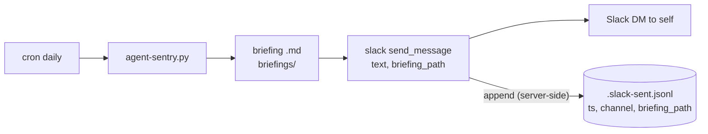
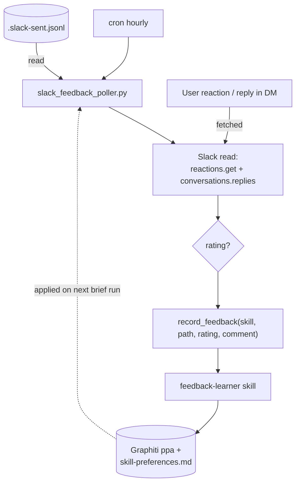

# HITL Feedback over Slack (Human-in-the-Loop)

> Two-way feedback loop: agent-sentry DMs you a briefing in Slack, you react (👍/👎) and/or
> reply with a correction, and an hourly poller feeds that back into the **existing**
> `feedback-learner` skill — which distills durable, per-skill preferences applied on every
> future run.

This is a **polling** design (no real-time daemon, no Socket Mode). It matches the existing
cron-driven, stdio-MCP architecture.

---

## Why

Today agent-sentry only **pushes** briefings to Slack (`src/slack_mcp_server.py` →
`chat.postMessage`). There is no inbound path — when you react or reply to the DM, nothing reads
it. The only feedback channel is the frontend UI's 👍/👎 buttons (`POST /feedback` →
`sentry_core.record_feedback()` → `feedback-learner`).

This adds a **second source** for that same feedback pipeline: your Slack reactions and replies.
`feedback-learner` is unchanged — it already accepts `(target_skill, briefing_path, rating, comment)`.

---

## Architecture

The loop has two halves: **outbound + capture** (record which Slack message maps to which
briefing), and the **inbound poll** (read your reaction/reply and submit feedback).

### 1. Outbound + capture

When a brief is relayed to Slack, the Slack MCP records the returned message `ts` (the only piece
missing today) into a local sent-map, so a later poll knows which message belongs to which briefing.

🎨 **Excalidraw (editable):** https://excalidraw.com/#json=2E-0dRnReMEmiFLP6gyuN,LMy4VJfDY4-KI3evP79UHw



### 2. Inbound poll loop

Hourly, the poller reads the sent-map, pulls reactions + thread replies for each recent brief,
resolves a rating, and calls the existing `record_feedback()`. The learned preferences land in
Graphiti + `memory/skill-preferences.md` and are applied on the next brief run — closing the loop.

🎨 **Excalidraw (editable):** https://excalidraw.com/#json=DqxaFTtiImuNdppatMsua,AwvCi5pXiXysfqkeNWox1w



**Rating resolution** (confirmed design):

| Slack state | Rating sent | Effect in feedback-learner |
|-------------|-------------|----------------------------|
| 👍 (`thumbsup`/`+1`) | `up` | reinforce; if a comment is also present, refine prefs |
| 👎 (`thumbsdown`/`-1`) | `down` | learning path — distill a rule from the comment |
| reply/comment only, no reaction | `down` | learning path (a reply is treated as a correction) |
| both 👍 and 👎 | `down` | 👎 wins |
| no reaction **and** no comment | — | **skip** (nothing to learn) |

---

## Slack creds / scopes

Same **bot token** `xoxb-…` (`SLACK_BOT_TOKEN`). No user token, no app-level (`xapp-`) token, no
public endpoint. The bot is already a party to its DM with you, so it can read your replies there.

| Scope | Status | Why |
|-------|--------|-----|
| `chat:write` | existing | post the brief |
| `users:read.email` | existing | resolve `self` → your email → DM |
| `im:write` | existing | open the DM |
| `reactions:read` | **add** | read 👍/👎 on the brief message → rating |
| `im:history` | **add** | read your reply in the DM → comment |

After adding scopes, **reinstall the app** to re-grant the token.

---

## Components / files

| File | Change | Purpose |
|------|--------|---------|
| `src/slack_client.py` | **new** | shared Slack Web API client (auth + 429/5xx backoff + `resolve_channel`), extracted from the MCP server so the poller reuses it |
| `src/slack_mcp_server.py` | modify | use `slack_client`; extend `send_message(channel, text, briefing_path=None)` to append the sent-map line after a successful post |
| `src/sentry_core.py` | modify | relay prompt (≈ `sentry_core.py:415`): pass `briefing_path=briefings/<file>` to `send_message` |
| `src/slack_feedback_poller.py` | **new** | hourly entrypoint: read sent-map → Slack reactions/replies → resolve rating → `record_feedback()`; dedup; `--dry-run` |
| `crontab.example` | modify | hourly poll job |
| `.env.example` | modify | document the 2 new scopes; add `SLACK_FEEDBACK_RETENTION_DAYS=3`, `SLACK_FEEDBACK_TOPLEVEL_FALLBACK=0` |
| `.gitignore` | modify | ignore `briefings/.slack-sent.jsonl`, `briefings/.slack-processed.json` |

`feedback-learner` and the frontend UI feedback path are **untouched**.

### State files (runtime, git-ignored)

- `briefings/.slack-sent.jsonl` — append-only **correlation map** written at send time:
  `{"ts","channel","briefing_path","skill","sent_at"}`. The `ts` ties a reaction/reply to one
  briefing; the `skill` ties it to the skill whose preferences must change. `skill` is stored
  explicitly (the engine knows it at relay time) — filename reverse-map is only a fallback.
- `briefings/.slack-processed.json` — `{ts: last_signature}` where
  `signature = sha256(ts + sorted_reactions + comment)`. Skips a poll when nothing changed (so a
  standing 👍 doesn't re-fire every hour); reprocesses when you add/change a reaction or reply.

### Cron (hourly)

```cron
# Slack feedback poller — hourly: pull reactions/replies on relayed briefs into feedback-learner.
30 * * * *  cd /Users/ashish.desai/Desktop/MyGIT/ppa && .venv/bin/python src/slack_feedback_poller.py >> logs/briefings/feedback-poll.log 2>&1
```

### Correlation: response → briefing → skill

Feedback must tie back to both the exact briefing and the skill that produced it, so the learned
rule lands in that skill's preferences and changes its **next** run.

- **Join key = `ts`.** The Slack message id from `chat.postMessage`. Reactions attach to it
  (`reactions.get(channel, ts)`); a reply's `thread_ts` equals it
  (`conversations.replies(channel, ts)`) — both bind unambiguously to one brief.
- **Skill = the `skill` field on the sent-map record** (authoritative). This becomes `target_skill`
  in `record_feedback(...)` → written to `skill-preferences: <skill>` → applied next run. Fallback
  only if absent: `briefing_name` from the filename → skill via `sentry_core.discover_skills()`.
- **Reply convention:** brief footer says "reply *in thread* to give feedback" so the reply carries
  `thread_ts` and binds exactly.
- **Top-level fallback (optional, `SLACK_FEEDBACK_TOPLEVEL_FALLBACK`):** a non-threaded DM reply is
  attributed to the most-recent unprocessed brief in that DM. Fuzzy with multiple pending briefs —
  off by default.

Only slack-relayed briefs land in the sent-map, so non-relayed artifacts (e.g. `feedback-receipt`)
never enter the loop.

---

## Security

- **Untrusted input:** Slack reply text → `record_feedback`'s `comment`, which `feedback-learner`
  already wraps in `<user_comment>` delimiters and treats as DATA, never instructions. The poller
  enforces the same `MAX_FEEDBACK_COMMENT_CHARS` cap.
- **No secrets in logs:** reuse the client's "never log token / full request" rule; the poller logs
  only `ts` / skill / rating / processed-state — not raw reply bodies.
- **Outbound allowlist:** all calls stay on the single fixed host `https://slack.com/api`
  (no user-controlled URL).
- **Least privilege:** only `reactions:read` + `im:history` added; bot identity, DM-scoped. No
  channel-history scope unless briefs are ever relayed to a channel.

---

## Verification (end-to-end)

1. Add `reactions:read` + `im:history` in the Slack app config; reinstall; confirm `SLACK_BOT_TOKEN`.
2. Run a brief: `python src/agent-sentry.py --skill meeting-prep` → DM arrives; confirm a line lands
   in `briefings/.slack-sent.jsonl` with a real `ts`.
3. In Slack, react 👎 to the DM and reply in-thread, e.g. "drop the Eliminate quadrant".
4. `python src/slack_feedback_poller.py --dry-run` → log shows resolved `skill=meeting-prep`,
   `rating=down`, comment captured, would call `record_feedback` (no writes).
5. Real run: `python src/slack_feedback_poller.py` → a `briefings/feedback-receipt-*.md` appears,
   `memory/skill-preferences.md` gains/updates the rule, and `feedback:` / `skill-preferences:`
   episodes exist in Graphiti (group `ppa`).
6. Re-run immediately → entry **skipped** (signature unchanged) — dedup works.
7. Add a second reply → re-run → reprocessed (new signature) — incremental learning works.
8. Install the cron line; check `logs/briefings/feedback-poll.log` after the next hour.
